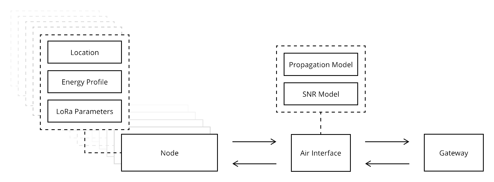

# LoRaEnergySim

The framework consists of three main components, i.e., nodes, an air interface and a gateway.
The nodes send messages to the gateway via the air interface.
Collisions and weak messages are detected in the air interface component.
The uncollided and strong packets are delivered to the gateway, whereafter a downlink message will be scheduled if requested by the node.



## How to cite?

```latex
@INPROCEEDINGS{8885739,  
author={G. {Callebaut} and G. {Ottoy} and L. {van der Perre}},  
booktitle={2019 IEEE Wireless Communications and Networking Conference (WCNC)},   
title={Cross-Layer Framework and Optimization for Efficient Use of the Energy Budget of IoT Nodes},   
year={2019},  
volume={},  
number={},  
pages={1-6},
}
```

Other publications:

```
G. Callebaut, G. Ottoy and L. V. d. Perre, "Optimizing Transmission of IoT Nodes in Dynamic Environments," 
2020 International Conference on Omni-layer Intelligent Systems (COINS), 2020, pp. 1-5, doi: 10.1109/COINS49042.2020.9191674.
```


## How to use?
The source of the framework is located in the `Framework` folder.
The `Simulations` folder contains some examples.

### General Workflow
In order to compare different settings/configurations, it is imperative that the locations of the nodes are the same for all simulations.
Therefore, a file `generate_locations.py` is included in the examples.

#### Generate Node locations

Configurable parameters:
- number of locations, i.e., number of IoT nodes
- cell size, the cell is here a rectangular area. The cell size will determine the length of the edges in meters
- number of Monto-carlo simulations to run. As the simulation contains random and non-determinstic behavior and different location sets, 
  averaging the results over multiple simulations will have a more statistical meaning.
  
For each simulation, a random set of locations inside the area is generated and is stored in the `location_file` 
which is a parameter defined in the `GlobalConfig.py` file. 


#### Simulation.py
In the simulation file, you will use the building blocks in the framework to simulate a specific environment and 
acquire results such as the consumed energy, and the number of collided messages. See section `Framework` (below) for configurable parameters and output.
Please see the comments in the `Example>simulation.py` on how to write a simulation file. 
In `simulation.py` you load the locations, specify the object to hold the results and specify what you want to simulate.
In `SimulationProcess`, the simulation itself is run. The gateway is created, the nodes are generated with their lora parameters and energy profile.
Afterwhich the simulation is run. After completion of one simulation the results are extracted from the objects and returned, to be used in the `simulation.py` file.

The project can now be run by first running `generate_locations.py` and then `simulation.py`.

## Framework

Please read first the paper to have a more detailed understanding of the framework with respect to LoRaWAN operation and limitations.

### Propagation Model
The propagation model determines how the messages are impacted by the environment. 
It predicts the path loss, i.e., how much the signal is attenuated between the transmitter and receiver, for a given environment. 
The `PropagationModel.py` contains (currently) two implementations:

- log shadow model or log-distance path loss model, where the default parameters are based on the Rep. ITU-R P.2346-0 and J. Petajajarvi, K. Mikhaylov, A. Roivainen, T. Hanninen and M. Pettissalo, "On the coverage of LPWANs: range evaluation and channel attenuation model for LoRa technology," 2015 14th International Conference on ITS Telecommunications (ITST), 2015, pp. 55-59, doi: 10.1109/ITST.2015.7377400.
- COST231, including more details about the environment, e.g., building heights

### SNR Model
This model transforms the received signal strength (RSS) to a signal-to-noise ratio (SNR) by the method `rss_to_snr`.
At this moment the noise is only affected by the [thermal noise](https://en.wikipedia.org/wiki/Johnson%E2%80%93Nyquist_noise).
This results in (dB):
```python
SNR = RSS - (-174 + 10 * log10(125e3))
```


### LoRa Parameters
All parameters specific to the lora protocol (lorawan) and measured energy consumption related to these parameters are here included.

### LoRaPacket
LoRaPackets are send over the air interface from the nodes to the gateway.
`LoRaPacket` contains a uplink and downlink message class, including relevant metadata and information concerning the state of the message, e.g., received, collided,...

### Energy Profile
The energy profile class contains the sleep, processing, transmitting and received power of a node.
This can be different for each node and can be defined in the `simulation.py` file.

### Node
The Node class contains all information regarding the power consumption, number of messages send, payload send, retransmissions, ...
Nodes act as real IoT nodes, joining the network, waiting, sleeping, transmittion and receiving. Their behaviour is determined in the main `simulation.py` file.


After running the simulation, you can extract the following iniformation:
- `energy_per_bit`. This is the amount of energy consumed to send one bit of data
- `transmit_related_energy_per_bit`. This only contains the energy spend in transmit mode.
- `transmit_related_energy_per_unique_bit`. This only contains the energy spend in transmit mode and tx'ed retransmissions are not count against the transmitted bits
-  `total_energy_consumed`
- `get_simulation_data`:
```python
series = {
            'WaitTimeDC': self.total_wait_time_because_dc / 1000,  # [s] instead of [ms]
            'NoDLReceived': self.num_no_downlink,
            'UniquePackets': self.num_unique_packets_sent,
            'TotalPackets': self.packets_sent,
            'CollidedPackets': self.num_collided,
            'RetransmittedPackets': self.num_retransmission,
            'TotalBytes': self.bytes_sent,
            'TotalEnergy': self.total_energy_consumed(),
            'TxRxEnergy': self.transmit_related_energy_consumed(),
            'EnergyValuePackets': self.energy_value
        }
```

### Air interface
The air interface detects collisions and alters the LoRaPacket object so the node and gateway know what happened during the transmission of the message.
It employs the used propagation model and snr model to determine if the transfer was successful or not.

### Gateway
At the gateway, the received SNR is checked and messages below the required threshold are marked as weak and is not rx'ed.
The gateway also handles DL messages if requested by the node.


#### Configurable Properties
- energy_profile: EnergyProfile, 
- lora_parameters, 
- sleep_time, 
- process_time, 
- adr, 
- location,
- payload_size,  
- confirmed_messages=True

#### What is currently tracked
 - 'WaitTimeDC': total_wait_time_because_dc
 - 'NoDLReceived': num_no_downlink,
 - 'UniquePackets': num_unique_packets_sent,
 - 'TotalPackets': packets_sent,
 - 'CollidedPackets': num_collided,
 - 'RetransmittedPackets': num_retransmission,
 - 'TotalBytes': bytes_sent,
 - 'TotalEnergy': total_energy_consumed(),
 - 'TxRxEnergy': transmit_related_energy_consumed(),


## Common Erros

Q: Can't find Globaconfig, Locations, ....<br>
A: Ensure that the folders Framework and Simulations are marked as Source Root. For Pycharm right click on the folder > Mark directory as > Source Root

Q: no output in IPython/Spyder<br>
A: The code is run in parralel by default and the std output is not handled well in that case. You can run the code sequently, see the comments in Example/simulation.py regarding the pool.map function at the bottom.
